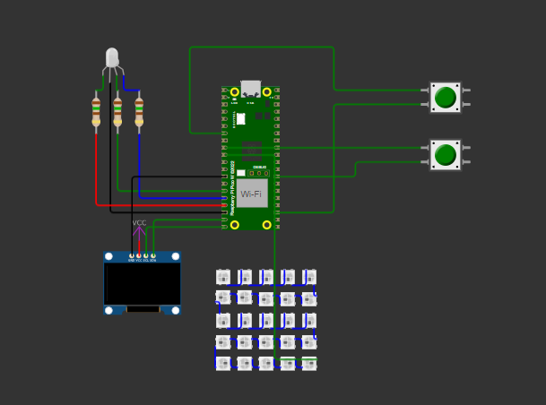

# Utilizando I2C e UART com a BitDogLab

### Link para o vídeo:

[Vídeo no Youtube](https://www.youtube.com/watch?v=IWikM5EPRlU)

### por: Heitor Lemos

Este projeto demonstra a integração de múltiplas interfaces em um Raspberry Pi Pico W (na plataforma BITDOGLAB), combinando comunicação serial, display OLED SSD1306, matriz de LEDs WS2812 (5×5) e botões para controle de um LED RGB. O objetivo é oferecer uma aplicação interativa que responde tanto à entrada serial quanto a eventos físicos, exemplificando a versatilidade do Pico W.

## Clonando o Repositório

Para clonar este repositório, utilize o Git com o seguinte comando:

```bash
git clone https://github.com/TorRLD/serial_display.git
```


## Funcionalidades

- **Comunicação Serial e Display OLED:**

  - Cada caractere digitado no Serial Monitor é exibido no display OLED.
  - Se o caractere for um dígito (0–9), a matriz WS2812 é atualizada para mostrar o padrão digital correspondente.
- **Matriz de LEDs WS2812:**

  - Matriz 5×5 (25 LEDs) controlada via PIO.
  - Cada dígito é representado com um padrão de LEDs acesos e apagados.
- **Controle via Botões:**

  - **Botão A (GPIO5):** Alterna o estado do canal **Verde** do LED RGB e exibe uma mensagem de status tanto no OLED quanto no Serial Monitor.
  - **Botão B (GPIO6):** Alterna o estado do canal **Azul** do LED RGB e exibe uma mensagem de status tanto no OLED quanto no Serial Monitor.
- **USB Console:**

  - Utiliza a opção **"Console over USB (disables other USB use)"** para redirecionar a saída `stdio` (por exemplo, `printf()`) para o Serial Monitor da extensão Raspberry Pi Pico no VS Code.

## Hardware Necessário

- **Raspberry Pi Pico W**
- **Display OLED SSD1306 (I2C)**

  - SDA: GPIO14
  - SCL: GPIO15
- **Matriz de LEDs WS2812 (5×5 – 25 LEDs)**

  - Pino de dados: GPIO7
- **LED RGB**

  - Canal Verde: GPIO13
  - Canal Azul: GPIO12
- **Botões Push**

  - Botão A: GPIO5 (controle do LED Verde)
  - Botão B: GPIO6 (controle do LED Azul)

  ### Esquema de ligações

  

    Fonte: Autor.

## Ambiente de Desenvolvimento

- **IDE:** Visual Studio Code
- **Extensão:** Raspberry Pi Pico para VS Code
- **Método de Compilação e Execução:**
  - A compilação e a gravação do código são realizadas através da opção **"Compile and Run"** da extensão.
  - **Não** são utilizados comandos CMake manualmente.
- **Configuração do `stdio`:**
  - Selecione **"Console over USB (disables other USB use)"** para que a saída padrão seja direcionada para o Serial Monitor via USB.

## Estrutura do Projeto

- **serial_display.c:**
- Contém o código principal que integra a leitura serial, manipulação dos botões, atualização do display OLED e controle da matriz WS2812.
- **ws2812.pio.h:**
- Biblioteca para controle dos LEDs WS2812 via PIO.
- **ssd1306.h e font.h:**
- Bibliotecas para gerenciamento do display OLED e renderização de fontes.

## Como Utilizar

1. **Configuração do Hardware:**Conecte todos os dispositivos ao Raspberry Pi Pico W conforme a seção de Hardware Necessário.
2. **Abrir o Projeto:**Abra a pasta do projeto no Visual Studio Code.
3. **Compilar e Executar:**Utilize a opção **"Compile and Run"** fornecida pela extensão Raspberry Pi Pico para compilar e gravar o firmware no Pico W.
4. **Operação:**

   - **Serial Monitor e OLED:**
     - Abra o Serial Monitor na extensão.
     - Digite caracteres. Cada caractere será exibido no OLED.
     - Se for digitado um dígito (0–9), a matriz WS2812 exibirá o padrão correspondente.
   - **Botões:**
     - Pressione o **Botão A (GPIO5)** para alternar o LED Verde. A operação será exibida no OLED e registrada no Serial Monitor.
     - Pressione o **Botão B (GPIO6)** para alternar o LED Azul. A operação será exibida no OLED e registrada no Serial Monitor.

## Licença

Este projeto está licenciado sob a [Licença MIT](#licença-mit).

---

## Licença MIT

```
MIT License

Copyright (c) 2025 Heitor Lemos

Permission is hereby granted, free of charge, to any person obtaining a copy
of this software and associated documentation files (the "Software"), to deal
in the Software without restriction, including without limitation the rights
to use, copy, modify, merge, publish, distribute, sublicense, and/or sell
copies of the Software, and to permit persons to whom the Software is
furnished to do so, subject to the following conditions:

The above copyright notice and this permission notice shall be included in all
copies or substantial portions of the Software.

THE SOFTWARE IS PROVIDED "AS IS", WITHOUT WARRANTY OF ANY KIND, EXPRESS OR
IMPLIED, INCLUDING BUT NOT LIMITED TO THE WARRANTIES OF MERCHANTABILITY,
FITNESS FOR A PARTICULAR PURPOSE AND NONINFRINGEMENT. IN NO EVENT SHALL THE
AUTHORS OR COPYRIGHT HOLDERS BE LIABLE FOR ANY CLAIM, DAMAGES OR OTHER
LIABILITY, WHETHER IN AN ACTION OF CONTRACT, TORT OR OTHERWISE, ARISING FROM,
OUT OF OR IN CONNECTION WITH THE SOFTWARE OR THE USE OR OTHER DEALINGS IN THE
SOFTWARE.
```

---
